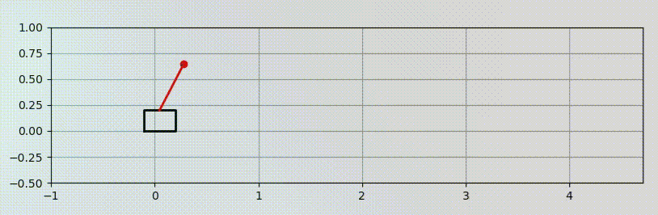
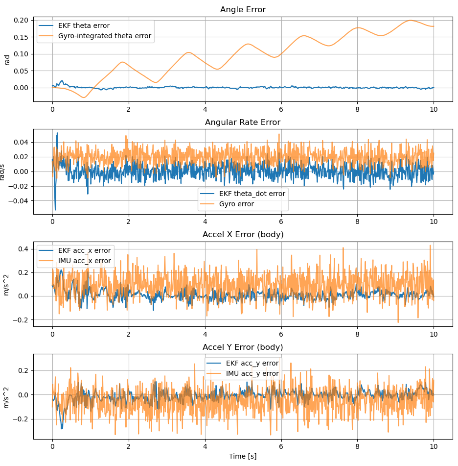

# 2D Pendulumn balancing using EKF and IMU sensor

## Motivation
In another project [Butler-Bot](https://github.com/GitM3/butler-bot) a bottle catching robot was implemented. Next I investigate how to balance the bottle if the user is especially tipsy! Bottle balancing is often modeled by an inverted pendulum and practically implemented using IMU.

IMU's tend to be noisy and the non-linear dynamics of the system make it suitable for robust estimation using an Extended Kalman Filter.
## Overview and Results
The state of the robot is simplified to two dimensions. The IMU can be used to infer the angle of the pendulum which is used to determine the control force $u$.

Altough the focus is on the Kalman Filter implementation the simulation includes the inverted pendulum robot dynamics and a LQR controller to stabilize 
a theoretical bottle using a noisy IMU mounted on the pendulum tip. The simulation can be run live at this [link](https://probabilisticshukudai.streamlit.app/)!

Compared to naive IMU integration for the state estimate, the EKF reduces RMSE error in state estimation and compensates for accelerometer bias.

## Details
### IMU sensor
- Reference for model: https://arxiv.org/pdf/2307.11758
Let Ground truth pose be:

$$
\mathbf{p}_k = \begin{bmatrix} x_k \\ y_k \end{bmatrix},
\quad
\mathbf{v}_k = \begin{bmatrix} v_{x,k} \\ v_{y,k} \end{bmatrix},
\quad
\theta_k \in \mathbb{R}
$$

#### Gyro Model
$\tilde{\omega}=\dot{\theta}_{k}+b_{g}+\eta_{g}$
	- True velocity + bias + additive, zero-mean Gaussian noise.
	- Measurement:

$$
\tilde{\omega}_k = \frac{\theta_{k+1} - \theta_k}{\Delta t}+b_g+n_g
$$

#### Accelerometers
$\tilde{a}=R(\theta^T)(\dot{v}-g^w)+b_{a}+\eta_{a}$
$g^w=[0,g]$

$$
R(\theta_k) =\begin{bmatrix}\cos\theta_k & -\sin\theta_k \\\sin\theta_k &  \cos\theta_k\end{bmatrix}
$$

$$
\tilde{\mathbf{a}}_k=R(\theta_k)^\top\left(\mathbf{a}^W_k - \mathbf{g}^W\right)+\mathbf{b}_a+\mathbf{n}_a
$$
where
$$
\mathbf{a}^W_k=\frac{\mathbf{v}_{k+1} - \mathbf{v}_k}{\Delta t}
$$
### Output
For a test circular trajectory, the ground truth is compared to different noise levels.

### Inverted Pendulum

- [Derivation Reference](https://www.youtube.com/watch?v=iR-Ju4rwta4)
$$
\begin{aligned} & \dot{x} =\frac{d x}{d t}=v \\ & \ddot{x}=\frac{d \theta}{d t}=\frac{d^2 x}{d t^2}=\frac{L u+B_m \dot{\theta} \cos (\theta)-m L g \sin (\theta) \cos (\theta)+m L^2 \dot{\theta}^2 \sin (\theta)-B_M L \dot{x}}{L\left(M+m-m \cos ^2(\theta)\right)} \\ & \dot{\theta}=\frac{d \theta}{d t}=\omega \\ & \ddot{\theta}=\frac{d \omega}{d t}=\frac{d^2 \theta}{d t^2}=\frac{-m L \cos (\theta) U-m^2 L^2 \dot{\theta}^2 \sin (\theta) \cos (\theta)+B_M \dot{x} m L \cos (\theta)-(M+m) B_m \dot{\theta}+(M+m) m g L \sin (\theta)}{m L^2\left(M+m-m \cos ^2(\theta)\right)} \end{aligned} 
$$
Using RK4 numerical integration for forward dynamics. [Runge-Kutta](https://lpsa.swarthmore.edu/NumInt/NumIntFourth.htm)

### Models
State and input:

$$
\mathbf{x} = \begin{bmatrix} x & \dot{x} & \theta & \dot{\theta} & b_g & b_{ax} & b_{ay} \end{bmatrix}^\top, \quad u \in \mathbb{R}.
$$

Continuous dynamics from the simulator (cart mass $M$, pole mass $m$, length $L$, gravity $g$):

$$
\dot{\mathbf{x}} = \mathbf{f}_c(\mathbf{x}, u) = \begin{bmatrix}
\dot{x} \\
\ddot{x}(\mathbf{x}, u) \\
\dot{\theta} \\
\ddot{\theta}(\mathbf{x}, u) \\
\dot{b}_g \\
\dot{b}_{ax} \\
\dot{b}_{ay}
\end{bmatrix}, \quad \text{with }\dot{b}_g=\dot{b}_{ax}=\dot{b}_{ay}=0 \text{ (random walk in discrete time)}.
$$

Numerically integrate with RK4 to obtain the discrete transition:

$$
\mathbf{x}_{k+1} = \mathbf{f}(\mathbf{x}_k, u_k) \approx \begin{bmatrix}\mathrm{RK4}\big(\mathbf{f}_c^{(4)},\, \mathbf{x}^{(4)}_k,\, u_k,\, \Delta t\big) \\ b_{g,k} \\ b_{ax,k} \\ b_{ay,k}\end{bmatrix},
$$
where $\mathbf{f}_c^{(4)}$ is the cart-pendulum dynamics on $\mathbf{x}^{(4)}=[x,\dot{x},\theta,\dot{\theta}]^\top$, while biases are held constant between steps (random-walk process noise is added through $\mathbf{R}_t$ on the bias subspace). TODO: Check this.

IMU at the tip measures angular rate and specific force in the body frame. Let the tip world acceleration be $\mathbf{a}^W$ and gravity be $\mathbf{g}^W = [0,\; -g]^\top$. The body-frame specific force is

$$
\mathbf{a}^B = R(\theta)^\top\big(\mathbf{a}^W - \mathbf{g}^W\big),\quad R(\theta)=\begin{bmatrix}\cos\theta & -\sin\theta\\ \sin\theta & \cos\theta\end{bmatrix}.
$$

The tip acceleration is computed:

$$
\mathbf{v}_\text{tip} = \begin{bmatrix}\dot{x} + L\cos\theta\,\dot{\theta} \\ -L\sin\theta\,\dot{\theta}\end{bmatrix},\quad
\mathbf{a}_\text{tip} = \begin{bmatrix}\ddot{x} - L\sin\theta\,\dot{\theta}^2 + L\cos\theta\,\ddot{\theta} \\ -L\cos\theta\,\dot{\theta}^2 - L\sin\theta\,\ddot{\theta}\end{bmatrix}.
$$

The measurement model is

$$
\mathbf{z}_k = \mathbf{h}(\mathbf{x}_k, u_k) + \mathbf{v}_k,\quad
\mathbf{h}(\mathbf{x},u) = \begin{bmatrix} \dot{\theta} + b_g \\ a_x^B + b_{ax} \\ a_y^B + b_{ay} \end{bmatrix} = \begin{bmatrix} \dot{\theta} + b_g \\ \big(R(\theta)^\top(\mathbf{a}_\text{tip}-\mathbf{g}^W)\big)_x + b_{ax} \\ \big(R(\theta)^\top(\mathbf{a}_\text{tip}-\mathbf{g}^W)\big)_y + b_{ay} \end{bmatrix}.
$$

Process and measurement noises are modeled Gaussian:

$$
\mathbf{w}_k \sim \mathcal{N}(\mathbf{0}, \mathbf{R}_t),\quad \mathbf{v}_k \sim \mathcal{N}(\mathbf{0}, \mathbf{Q}_t),
$$
with $\mathbf{R}_t=\operatorname{diag}(q_x, q_{\dot{x}}, q_\theta, q_{\dot{\theta}}, q_{b_g}, q_{b_{ax}}, q_{b_{ay}})$ and $\mathbf{Q}_t=\operatorname{diag}(\sigma_\omega^2,\sigma_a^2,\sigma_a^2)$. For now, setting $\mathbf{Q}_t$ from the IMU noise and choose $\mathbf{R}_t$ to capture unmodeled effects.

## EKF with Numerical Linearization
- Reference: Probabilistic Robotics.

At time $t$, given estimate $(\mu_{t-1}, \Sigma_{t-1})$, input $u_t$, and measurement $z_t$:

Prediction (motion update)

$$
\bar{\mu}_t=g(u_t, \mu_{t-1}),\quad  
G_t = \left.\frac{\partial g}{\partial x}\right|_{\mu_{t-1},u_t},\quad
\bar{\Sigma}_t = G_t\,\Sigma_{t-1}\,G_t^T + R_t.
$$

Update (measurement update)

$$
H_t = \left.\frac{\partial h}{\partial x}\right|_{\bar{\mu}_t,u_t},\quad
K_t=\bar{\Sigma}_t H_t^T(H_t \bar{\Sigma}_t H_t^T + Q_t)^{-1},\quad
\mu_t=\bar{\mu}_t+K_t(z_t-h(\bar{\mu}_t,u_t)),\quad
\Sigma_t=(I-K_t H_t)\,\bar{\Sigma}_t.
$$

Numerical Jacobians are computed by central differences with a small $\epsilon$:

$$
G_t[:,i] \approx \frac{g(\mu_{t-1} + \epsilon\,\mathbf{e}_i, u_t) - g(\mu_{t-1} - \epsilon\,\mathbf{e}_i, u_t)}{2\epsilon},\quad
H_t[:,i] \approx \frac{h(\bar{\mu}_t + \epsilon\,\mathbf{e}_i, u_t) - h(\bar{\mu}_t - \epsilon\,\mathbf{e}_i, u_t)}{2\epsilon}.
$$

### EKF Output
Since there is no observation on the x state (through a wheel encoder), there is no way to improve x estimates and as a result the total state estimate drifts:

If motion is aggressive, linearization errors will occur, which is a known limit of the EKF.
### LQR

- From [example](https://youtu.be/8QlS6L--Hic?si=pDTa_XyIbnLle6FW)
- LQR.
- Video has swing up, but I am keeping it simple:
- Weights used: $Q=\mathrm{diag}(1,\,1,\,10,\,100), R=10$.
- Continuous-time [solved](https://www.youtube.com/watch?v=ZktL3YjTbB4) and [CARE](https://en.wikipedia.org/wiki/Algebraic_Riccati_equation) in [python](https://python-control.readthedocs.io/en/0.10.2/generated/control.care.html) with their [implementation](https://github.com/python-control/python-control/blob/0.10.2/control/mateqn.py#L397):

$$
A^\top P + P A - P B R^{-1} B^\top P + Q = 0.
$$

- Optimal gain and control law (For continuous):

$$
K = R^{-1} B^\top P,\quad u = -K\,\bigl(x - x_{\mathrm{ref}}\bigr),\quad x_{\mathrm{ref}}=\mathbf{0}.
$$

