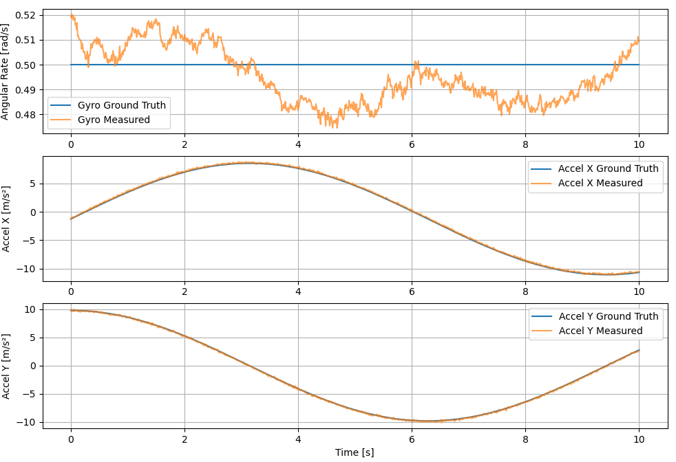

# 2D Pendulumn balancing using EKF and IMU sensor
## Motivation
In another project (Butler-Bot) a bottle should be caught. Next I investigate how to perhaps balance the bottle if the user is especially tipsy!
To simplify this project, I'll be assuming 2D since this I want to test my application of fundamental concepts rather than complex program.
## IMU sensor
- Reference https://arxiv.org/pdf/2307.11758
Let Ground truth pose be:

$$
\mathbf{p}_k = \begin{bmatrix} x_k \\ y_k \end{bmatrix},
\quad
\mathbf{v}_k = \begin{bmatrix} v_{x,k} \\ v_{y,k} \end{bmatrix},
\quad
\theta_k \in \mathbb{R}
$$

### Gyro Model
$\tilde{\omega}=\dot{\theta}_{k}+b_{g}+\eta_{g}$
	- True velocity + bias + additive, zero-mean Gaussian noise.
	- Measurement:

$$
\tilde{\omega}_k = \frac{\theta_{k+1} - \theta_k}{\Delta t}+b_g+n_g
$$

### Accelerometers
$\tilde{a}=R(\theta^T)(\dot{v}-g^w)+b_{a}+\eta_{a}$
$g^w=[0,g]$

$$
R(\theta_k) =\begin{bmatrix}\cos\theta_k & -\sin\theta_k \\\sin\theta_k &  \cos\theta_k\end{bmatrix}
$$

$$
\tilde{\mathbf{a}}_k=R(\theta_k)^\top\left(\mathbf{a}^W_k - \mathbf{g}^W\right)+\mathbf{b}_a+\mathbf{n}_a
$$
where
$$
\mathbf{a}^W_k=\frac{\mathbf{v}_{k+1} - \mathbf{v}_k}{\Delta t}
$$
### Noise
- Constant bias for now, adding random walk later.
### Output
- Circular trajectory:

## Inverted Pendulum
- [Derivation Reference](https://www.youtube.com/watch?v=iR-Ju4rwta4)
$$
\begin{aligned} & \dot{x} =\frac{d x}{d t}=v \\ & \ddot{x}=\frac{d \theta}{d t}=\frac{d^2 x}{d t^2}=\frac{L u+B_m \dot{\theta} \cos (\theta)-m L g \sin (\theta) \cos (\theta)+m L^2 \dot{\theta}^2 \sin (\theta)-B_M L \dot{x}}{L\left(M+m-m \cos ^2(\theta)\right)} \\ & \dot{\theta}=\frac{d \theta}{d t}=\omega \\ & \ddot{\theta}=\frac{d \omega}{d t}=\frac{d^2 \theta}{d t^2}=\frac{-m L \cos (\theta) U-m^2 L^2 \dot{\theta}^2 \sin (\theta) \cos (\theta)+B_M \dot{x} m L \cos (\theta)-(M+m) B_m \dot{\theta}+(M+m) m g L \sin (\theta)}{m L^2\left(M+m-m \cos ^2(\theta)\right)} \end{aligned} 
$$
Using RK4 numerical integration for forward dynamics. [Runge-Kutta](https://lpsa.swarthmore.edu/NumInt/NumIntFourth.htm)
### Output 

