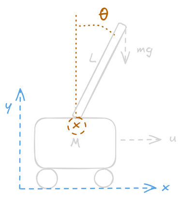
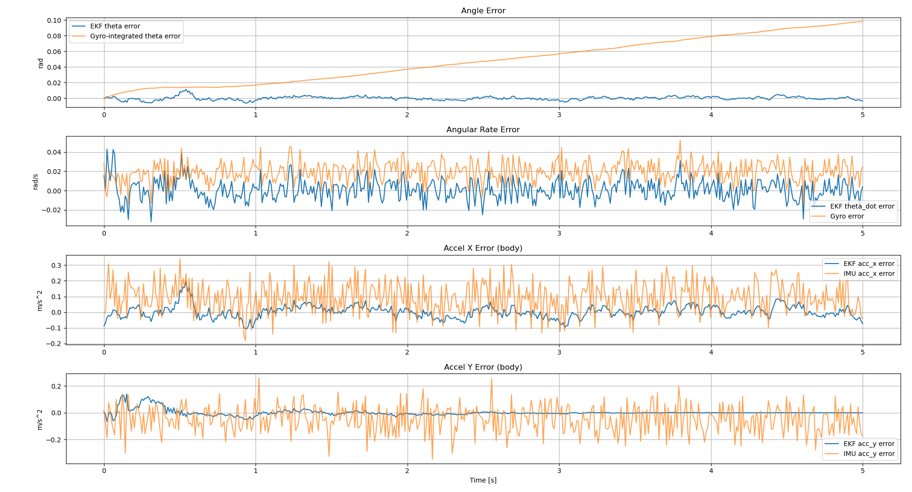
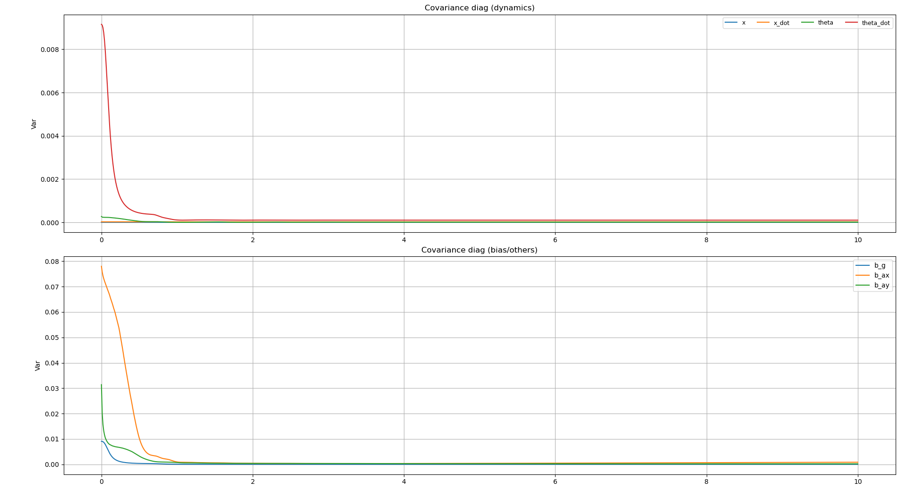
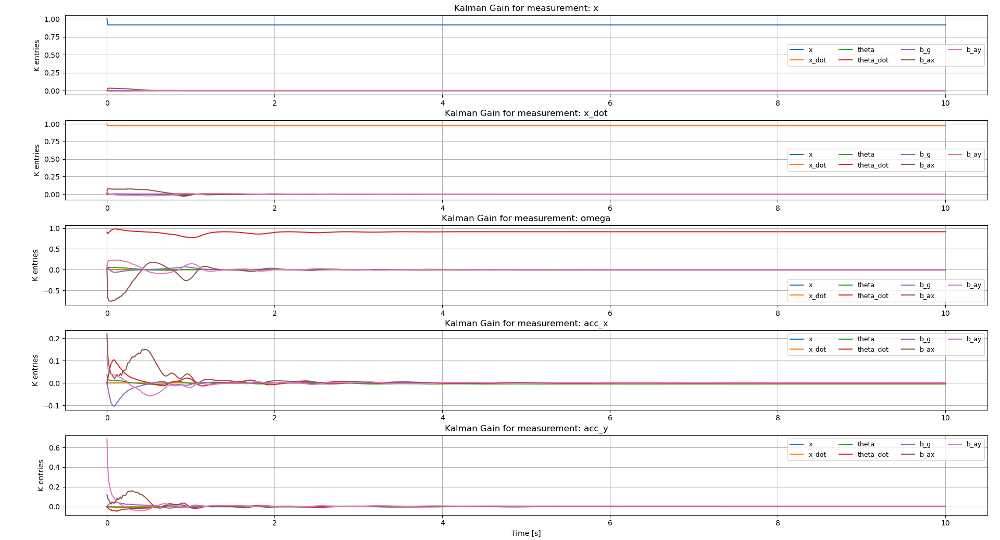

# 2D Pendulumn balancing using EKF and IMU sensor

> [!NOTE]
> The simulation can be run live at this [link](https://probabilisticshukudai.streamlit.app/)!
> (Please note it takes some time for the animation to load)
## Motivation
In another project [Butler-Bot](https://github.com/GitM3/butler-bot) a bottle catching robot was implemented. Next I investigate how to balance the bottle if the user is especially tipsy! 

Bottle balancing is often modeled by an inverted pendulum and practically implemented using IMU, but they tend to be noisy and the non-linear dynamics of the system make it suitable for robust estimation using an Extended Kalman Filter. The goal is to keep the pendulum upright!
## Overview and Results
Implemented:
1) IMU model
2) Inverted pendulum dynamics
3) EKF
4) LQR controller
5) Simulation

The state of the robot is simplified to two dimensions. The IMU is used to infer the angle of the pendulum which is used to determine the control force $u$.

Altough the focus is on the Kalman Filter implementation the simulation includes the inverted pendulum robot dynamics and a LQR controller to stabilize 
a theoretical bottle using a noisy IMU mounted on the pendulum tip. 

Compared to naive IMU integration for the state estimate, the EKF reduces RMSE error in state estimation and compensates for accelerometer bias.

## Implementation Details
### IMU sensor
Reference for the gyroscope and accelerometer [model](https://arxiv.org/pdf/2307.11758) was used and the ground truth pose is:

$$
\mathbf{p}_k = \begin{bmatrix} x_k \\ y_k \end{bmatrix},
\quad
\mathbf{v}_k = \begin{bmatrix} v_{x,k} \\ v_{y,k} \end{bmatrix},
\quad
\theta_k \in \mathbb{R}
$$

#### Gyro Model
- Measures the angular velocity of the pendulum tip.
$$
\tilde{\omega}_k = \frac{\theta_{k+1} - \theta_k}{\Delta t}+b_g+\eta_g
$$
- $\omega$ is the measured angular velocity from the true velocity with bias and zero-mean additive Gaussian noise $\eta_g$.

#### Accelerometers
- Measures the linear acceleration along the $x-y$ plane.
$$\tilde{a_k}=R(\theta_k^T)(a^W_k-g^w)+b_{a}+\eta_{a}$$
- Where gravity $g^w=[0,-g]^T$
- $R(\theta_k)$ is the 2D cartesian rotation matrix.
- where
$$
\mathbf{a}^W_k=\frac{\mathbf{v}_{k+1} - \mathbf{v}_k}{\Delta t}
$$
### IMU simulation results

For a test circular trajectory, the ground truth is compared to different noise levels.The gyroscope bias is clearly vissible in the top plot. The accelerometer results show a sinusodial graph as expected for a circular trajectory. The noise seems minimal but this causes issues when later integration is done for state estimation. 

### Inverted Pendulum

- cart mass $M$, pole mass $m$, length $L$, gravity $g$

The above is a simplified model of an inverted pendulum. This [reference](https://www.youtube.com/watch?v=iR-Ju4rwta4) was used in the derivation, including matlab code from the author that is included in this repo for convenience under `references/MATLAB`.

In summary, the state dynamics need for state-space representation of the robot is:

$$
\begin{aligned} & \dot{x} =\frac{d x}{d t}=v \\ & \ddot{x}=\frac{d \theta}{d t}=\frac{d^2 x}{d t^2}=\frac{L u+B_m \dot{\theta} \cos (\theta)-m L g \sin (\theta) \cos (\theta)+m L^2 \dot{\theta}^2 \sin (\theta)-B_M L \dot{x}}{L\left(M+m-m \cos ^2(\theta)\right)} \\ & \dot{\theta}=\frac{d \theta}{d t}=\omega \\ & \ddot{\theta}=\frac{d \omega}{d t}=\frac{d^2 \theta}{d t^2}=\frac{-m L \cos (\theta) U-m^2 L^2 \dot{\theta}^2 \sin (\theta) \cos (\theta)+B_M \dot{x} m L \cos (\theta)-(M+m) B_m \dot{\theta}+(M+m) m g L \sin (\theta)}{m L^2\left(M+m-m \cos ^2(\theta)\right)} \end{aligned} 
$$
Then using RK4 numerical integration [Runge-Kutta](https://lpsa.swarthmore.edu/NumInt/NumIntFourth.htm) the forward dynamics can be simulated. The following image shows how the pendulum falls under the force of gravity and oscillates since no controll is exerted yet. The dampening coefficient $B_m$ can be adjusted to match dampening of the pendulum (stiffer means it will converge quicker in oscillations).

### Integrating with IMU

IMU at the tip measures angular rate and specific force in the body frame and since the IMU is placed at the tip, the world acceleration $\mathbf{a}^W$ is computed:

$$
\begin{align}
\mathbf{v}_\text{tip} = \begin{bmatrix}\dot{x} + L\cos\theta\,\dot{\theta} \\ -L\sin\theta\,\dot{\theta}\end{bmatrix},\quad 
\mathbf{a}_\text{tip} = \begin{bmatrix}\ddot{x} - L\sin\theta\,\dot{\theta}^2 + L\cos\theta\,\ddot{\theta} \\ -L\cos\theta\,\dot{\theta}^2 - L\sin\theta\,\ddot{\theta}\end{bmatrix}.
\end{align}
$$

The measurement model is

$$
\begin{align}
\mathbf{z}_k = \mathbf{h}(\mathbf{x}_k, u_k) + \mathbf{\delta}_k,\quad
\mathbf{h}(\mathbf{x},u) = \begin{bmatrix} \dot{\theta} + b_g \\ a_x^B + b_{ax} \\ a_y^B + b_{ay} \end{bmatrix} = \begin{bmatrix} \dot{\theta} + b_g \\ \big(R(\theta)^\top(\mathbf{a}_\text{tip}-\mathbf{g}^W)\big)_x + b_{ax} \\ \big(R(\theta)^\top(\mathbf{a}_\text{tip}-\mathbf{g}^W)\big)_y + b_{ay} \end{bmatrix}.
\end{align}
$$

Process and measurement noises are modeled Gaussian as mentioned before.

$$
\mathbf{w}_k \sim \mathcal{N}(\mathbf{0}, \mathbf{R}_t),\quad \mathbf{v}_k \sim \mathcal{N}(\mathbf{0}, \mathbf{Q}_t),
$$
with $\mathbf{R}_t=\operatorname{diag}(q_x, q_{\dot{x}}, q_\theta, q_{\dot{\theta}}, q_{b_g}, q_{b_{ax}}, q_{b_{ay}})$ and $\mathbf{Q}_t=\operatorname{diag}(\sigma_\omega^2,\sigma_a^2,\sigma_a^2)$.

### EKF with Numerical Linearization
- Reference: Probabilistic Robotics.

At time $t$, given estimate $(\mu_{t-1}, \Sigma_{t-1})$, input $u_t$, and measurement $z_t$:

Prediction (motion update)

$$
\begin{align}
\bar{\mu}_t=g(u_t, \mu_{t-1}),\quad  
G_t = \left.\frac{\partial g}{\partial x}\right|_{\mu_{t-1},u_t},\quad
\bar{\Sigma}_t = G_t\,\Sigma_{t-1}\,G_t^T + R_t.
\end{align}
$$

Update (measurement update)

$$
\begin{align}
H_t = \left.\frac{\partial h}{\partial x}\right|_{\bar{\mu}_t,u_t},\quad
K_t=\bar{\Sigma}_t H_t^T(H_t \bar{\Sigma}_t H_t^T + Q_t)^{-1},\quad
\mu_t=\bar{\mu}_t+K_t(z_t-h(\bar{\mu}_t,u_t)),\quad
\Sigma_t=(I-K_t H_t)\,\bar{\Sigma}_t.
\end{align}
$$

The Jacobians can be solved analytically here, but for more complex system this is often impossible and hence for the sake of exercise numerical Jacobians are computed instead. Each partial derivative is calculated by central differences with a small $\epsilon$:

$$
G_t[:,i] \approx \frac{g(\mu_{t-1} + \epsilon\, u_t) - g(\mu_{t-1} - \epsilon\, u_t)}{2\epsilon},\quad
H_t[:,i] \approx \frac{h(\bar{\mu}_t + \epsilon\, u_t) - h(\bar{\mu}_t - \epsilon\,u_t)}{2\epsilon}.
$$
### EKF Results

Since the baseline is integrating the IMU output to determine the state it is compared with the EKF results above. We see a considerable decrease in error and bias reduction. The following table shows additional metrics for comparison.

$$

\begin{array}{l|l|c|c|c|c}
\textbf{Quantity} & \textbf{Method} &
\textbf{MAE} & \textbf{RMSE} & \textbf{Bias} & \textbf{Std (zero-mean)} \\
\hline
\theta~(\mathrm{rad}) &
\text{EKF} &
0.001699 & 0.002299 & -2.6\times 10^{-5} & 0.002298 \\
&
\text{Gyro integration} &
0.048416 & 0.055973 & 0.048416 & 0.028086 \\
\hline
\dot{\theta}~(\mathrm{rad/s}) &
\text{EKF} &
0.008406 & 0.010703 & 0.001015 & 0.010655 \\
&
\text{Gyro} &
0.020054 & 0.022349 & 0.019757 & 0.010446 \\
\hline
a_x~(\mathrm{m/s^2}) &
\text{EKF} &
0.030407 & 0.040054 & 0.002026 & 0.040003 \\
&
\text{IMU} &
0.111077 & 0.135404 & 0.093012 & 0.098403 \\
\hline
a_y~(\mathrm{m/s^2}) &
\text{EKF} &
0.011544 & 0.024116 & 0.001530 & 0.024067 \\
&
\text{IMU} &
0.087555 & 0.109962 & -0.048181 & 0.098844 \\
\end{array}
$$

Mean Absolute Error is used because it shows linear penalty on errors and shows on average how far an estimate is from the truth. RMSE on the other hand strongly penalizes large errors. Thus assessing both can give a good overview of long-term or stead-state tracking quality as well as seeing the effect of large errors that have a high chance of destabilizing control systems.
Bias is calculated as the mean of the error.

It is seen that the EKF reduces angular bias by over an order of magnitude and substantially lowers RMSE across all measured channels, demonstrating effective bias estimation and nonlinear sensor fusion.

>[!NOTE]
> In the error metrics the $x$ position is not included since we have no way of observing/measuring this state unless a wheel encoder or other sensor is added.
> I initially wanted to add this, but due to time constraint kept it for future developement.

Lastly, it is important to investigate the Kalman gains and covariance estimates. First, the estimated covariance $P_k$ show the filter's self-assessed uncertainty. Large errors with tiny covariance indicate overconfidence in estimates, while large covariances with small errors indicate overconservatism. Typically these consistency checks are done with statistical tests (such as NIS) to see whether the filter matches the underlying system modeling assumptions but for this assignment the following figure shows that for observed states there is a fast decay in angle uncertainty, giving sufficient confidence in modeling assumptions. The bias uncertainty decays slowly but the there is persistent and growing uncertainty for unobserved states (namely $x,\dot{x}$. This is expected from our system modeling as there is no sensor measuring the robot's position.

For the Kalman gains, it shows the filter's confidence in the measurements over the estimates. High gain gives measurements more weight while low gains favour model predictions. In the following image, it is seen what measurements contribute to state updates. 

As seen in the first plot, the $\omega$ measurement is directly observable through the gyroscope and hence the kalman gain for that state is higher than the rest as expected. Since there is state coupling with the position and position velocity, these are also non-zero as measurement gives some insight into these states.

What is also observed is that as the biases are identified (covariance shrinks) the filter has high confidence in its bias estimates and relies on the model more over time, reducing these gains.

For the acceleration measurements, there is initial fluctuation, but as the pendulum stabilizes, the dynamics become near linear and the model predictions become more accurate, reducing reliance on measurements. I believe this is a good sign since it could mean our system model is quite accurate and the model is trusted more than noisy acceleration measurements.

### EKF Pendulum integration
As an experiment, full state estimatation is compared to the ground truth dynamics (in other animations, the predicted $x$ state is not utilised).
Since there is no observation on the x state (through a wheel encoder), there is no way to improve x estimates and as a result the total state estimate drifts:

Additionally if motion is aggressive, linearization errors will occur, which is a known limit of the EKF.
### LQR
A LQR controller was implemented using the following references.

- From [example](https://youtu.be/8QlS6L--Hic?si=pDTa_XyIbnLle6FW)
- LQR.
- Video has swing up, but I am keeping it simple:
- Weights used: $Q=\mathrm{diag}(1,\,1,\,10,\,100), R=10$.
- Continuous-time [solved](https://www.youtube.com/watch?v=ZktL3YjTbB4) and [CARE](https://en.wikipedia.org/wiki/Algebraic_Riccati_equation) in [python](https://python-control.readthedocs.io/en/0.10.2/generated/control.care.html) with their [implementation](https://github.com/python-control/python-control/blob/0.10.2/control/mateqn.py#L397):

$$
A^\top P + P A - P B R^{-1} B^\top P + Q = 0.
$$

- Optimal gain and control law (For continuous):

$$
K = R^{-1} B^\top P,\quad u = -K\,\bigl(x - x_{\mathrm{ref}}\bigr),\quad x_{\mathrm{ref}}=\mathbf{0}.
$$

